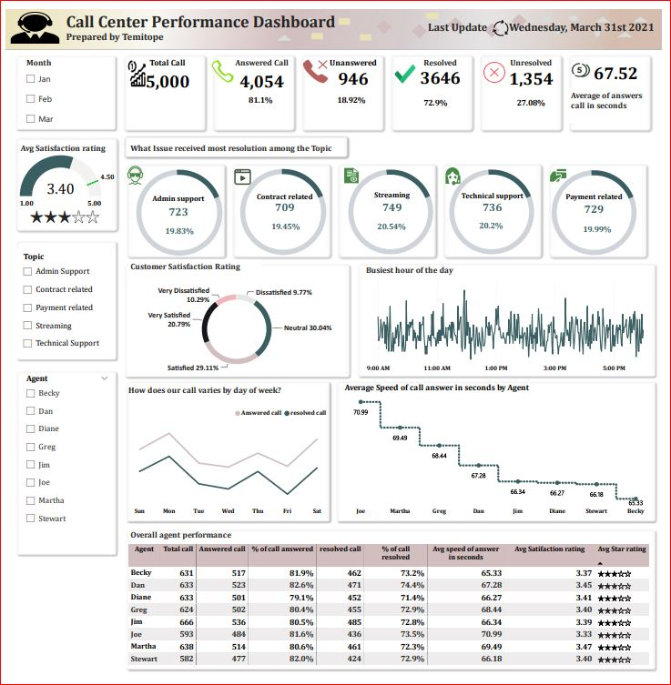

# Call Center PerformanceDashboard

***

### Introduction 
---

This dataset captures customer support interactions from January to March 2021, offering a glimpse into various topics like contracts, technical issues, payments, and more. Each entry includes call details, agent names, resolution status, speed of response, and satisfaction ratings. The interactions highlight patterns and efficiency in addressing customer concerns. Notably, the dataset concludes/ or last updated in March 2021, summarizing a three-month span of customer-agent engagements. It provides accessible insights into the dynamics of support interactions during this period.

#### Statement problem:

Create a dashboard in Power BI for Claire(Manager ) that reflects all relevant Key Performance Indicators (KPIs) and metrics in the dataset. 
Possible KPIs include (get you started, but not limited):
- Overall customer satisfaction
- Overall calls were answered/abandoned.
- Calls by time
- The average speed of answer
- Agent’s performance quadrant -> average handle time (talk duration) vs calls answered.

**Project Objectives:** 

As a data analyst in this project, my main responsibility is to analyze the inbound calls answered and left abandoned data of Call Center database, insights and also build a Power BI dashboard to visualize customer satisfaction which will improve the call handling time and speed of call answered as well as creation statistical report of agents will help team lead or operation head to analyze the performance of agents for appraisal.

_The purpose of this project was to find out the call trend over time and to find out how to sort out any issue with how they communicate with their customers._

_**Data Collection:**_ The dataset was gotten from PWC. The dataset features 5000 Calls from 01/01/2021 to 31/03/2021.

**Tool used**: PowerBi 

### Data Analysis and Preparation 

The following steps are involved in creating the Dashboard: 
1 Data exploration
2 Extract data 
3 Load data 
4 Data cleaning
5 Dax writing 
6 Report building 
7 Publishing into Powerbi Service 

- Data exploration to understand its structure and content.
- Extraction and loading into Power Query Editor for cleaning, addressing missing or redundant entries.
- Transformation of data, including converting "Call answered" and "Resolved" indicators to "Yes/No" format for clarity.
- Addition of new columns to enhance data quality and facilitate analysis.
- Creation of a satisfaction rating status column using conditional statements.
- Data loaded into Power BI Desktop environment for visualization.

**Satisfaction rating status** : How did i create that? I used a conditional column in power query editor environment to achieve that, since i already had satisfaction rating column with items ranging from 1-5. 

The metric used for satisfaction rating was:

If the satisfaction rating is equal to 1 then very dissatisfied, and if equal 2 dissatisfied and ,if equal 3 neutral and if equal 4 satisfied, and Else very satisfied. 

After the whole data cleaning process, I loaded back the data into powerbi destktop environment for data visualization. 

To achieve the KPIs and other insights the below are the skills demonstrated 
- Dax ( SUM FUNCTION, DIVIDE, CALCULATE, AVERAGE and etc )
- PowerPoint report canva design 
- Slicer 
- Color formating 
- Charts ( Table, line chart, and donut chart and gauge)
- Charts design 

Since its just a single table then there was no reason for creating data modeling hence, I carried out writing some DAX to achieve my KPIs such as 

##### Key Insights and Metrics

Total Call Volume: 5000 calls
Answered/Unanswered Calls: 4054 answered calls (81.08%) and 946 unanswered calls (18.92%)
Resolved/Unresolved Calls: 3646 resolved calls (72.92%) and 1354 unresolved calls (27.08%)
Average Speed of Response: 67.52 seconds
Average Satisfaction Rating: 3.40

Additional Insights 

**Top Resolved Cases by Topic** : Utilized a donut chart to identify common issues. Streaming service-related concerns constituted the majority, highlighting the need for further analysis in this area.
**Average Satisfaction Rating** : With a rating of 3.40 out of 5, customers generally seem satisfied with the resolution of their issues.
**Customers Satisfaction Status** : A significant portion (30%) falls under the neutral category, while 29% express satisfaction with the feedback received.
**Busiest Hour of the Day** : The peak activity occurs around 11 AM, particularly on Mondays, suggesting potential issues over the weekend that require attention.
**Average Speed of Response** : Becky emerges as the fastest agent with an average response time of 65.33 seconds, while Dan stands out with the highest percentage of calls answered (82.6%). Analyzing their strategies may provide insights for improving overall agent performance.

##### Other Insights 
- What cases received most resolutions among the call topic : To achieve this, I used Donut chart to visualized individual topic from Admin support, contract related, streaming, Technical support  and Payment related. 

Most cases was from Streaming service and At 749 with 20.45%, we can look critically into the Streaming service to see the reason why major complan were coming from them and notably the agents in the Streaming service should be commended for their professionalism in how they handled the customers and how they have been able to proffer solution to the customer's complaint. 

- Average Satisfaction Rating: 3.45 out of 5 star rating shows a positive satisfaction by the customers. This indicate that most of the cases were resolved up to the satisfaction of the customers. 

- Customers satisfaction rating status: Majority of the customers statisfaction status falls under the neutral catergory at 30% and at 29% the customers were satisfied with the feedback they got from the company's agent. 

- Busiest hour of the day: The busiest hour of the day falls around 11AM in the morning and precisely on Monday, this could be that customers had major issue over the weekend and they could not really enjoy the company's service provided over the weeend. This must be critically look into on how the customers would enjoy the service paid for over the weekend without interuption. 

- Average speed of calls answers in seconds : Clearly Becky is the agent with most speed of answer at 65.33 while Dan has the most percentage of call answer at 82.6% the company might need to find out the strategry at which these guys are using to ensure their uptimum performance and they may encourage the agent such as Joe and Martha to utilize that to ensure uptimum performance in their dealing with the customers.

### Data Visualization/ Dashboard

  __**Best Performing Agent**:___

Dan stands out as the best performing agent based on several metrics:
Highest percentage of calls answered (82.60%).
High percentage of calls resolved (74.40%).
Highest average satisfaction rating (3.45).
Relatively low average speed of answer (67.28 seconds).

__**Least Performing Agent**:__

Joe appears to be the least performing agent based on the analysis:
Slightly lower percentage of calls answered (81.60%).
Lower percentage of calls resolved (73.50%).
Lowest average satisfaction rating (3.33).
Highest average speed of answer (70.99 seconds).

### ACTION TO TAKE:

##Recommendations

- Focus on Streaming Service Issues: Given the significant number of resolutions in this area, it's crucial to delve deeper into the root causes of these issues and identify strategies for improvement.

- Weekend Service Improvement: The spike in activity on Mondays suggests potential service disruptions over the weekend. Exploring ways to ensure seamless service delivery during weekends could enhance customer satisfaction.

- Agent Performance Analysis: Further investigation into the strategies employed by top-performing agents like Dan and Martha could provide valuable insights for optimizing overall agent performance.

- Address Neutral Customer Satisfaction: The high proportion of customers in the neutral category indicates room for enhancement in resolving issues and enhancing overall satisfaction.

- Provide ongoing training and development opportunities to all agents to enhance their skills and knowledge and establish clear performance metrics and goals for each agent and provide regular feedback and support to help them achieve those goals.

- Provide targeted training and coaching sessions to help Joe improve his customer service skills, problem-solving abilities, and efficiency.

## Conclusion

By taking these actions, the call center can ensure that the best performing agents are recognized and rewarded, while also providing support and guidance to those who may be struggling, ultimately leading to improved overall performance and customer satisfaction.

You can interact with the report [Here](app.powerbi.com/groups/me/reports/98d9d038-95a9-4384-8df6-9d48dfacbe1e/ReportSection08522ebdfeb28c21b2b9?experience=power-bi)

Let's connect on Linkedin You can interact with the report [Here](https://www.linkedin.com/in/temitopeatanda/)
  

